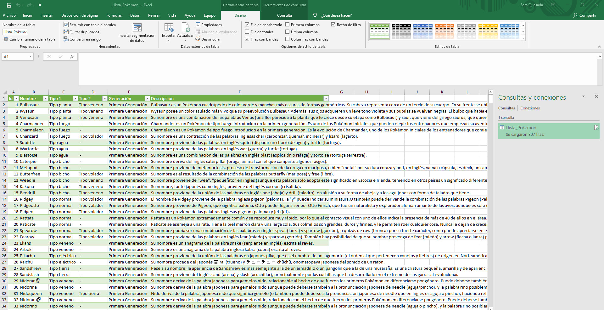
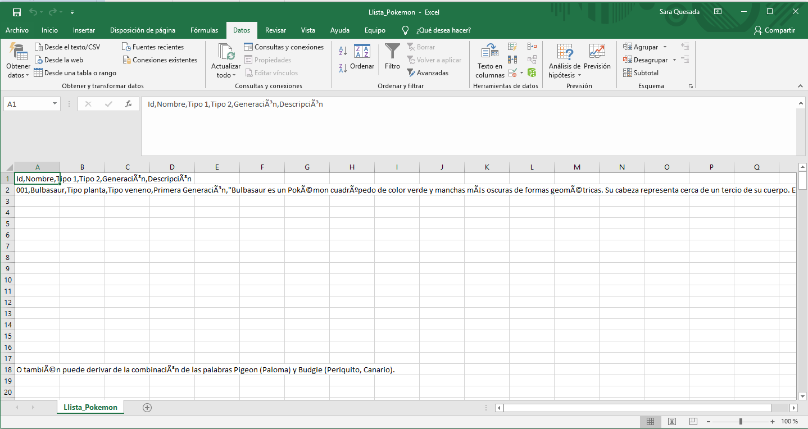
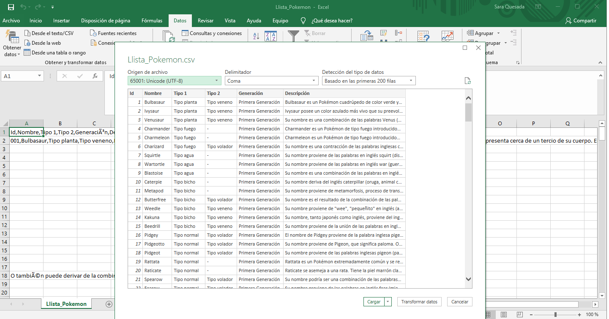
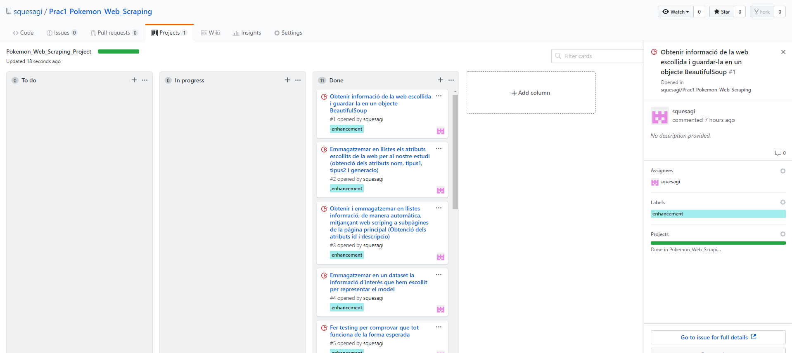

# Prac1_Pokemon_Web_Scraping
Aquest repositori correspon al desenvolupament de la tècnica de webscraping sobre una pàgina web que conté informació sobre el món Pokémon.

# Introducció
El lloc web triat és: https://pokemon.fandom.com/es/wiki/Lista_de_Pok%C3%A9mon 
El context en què s’ha recol·lectat la informació és un entorn amb una estructura HTML mitjanament complexa a causa de la gran quantitat de dades que hi han però, especialment, degut a la distribució d’aquestes, ja que algunes es trobaven en subpàgines de la principal.
El lloc web proporciona aquesta informació per informar al gran volum de persones interessades en el joc de Pokémon (i derivats) sobre dades d’origen d’aquests, habilitats de joc, ... Considero que aquesta és una de les moltíssimes pàgines que han detectat el gran benefici que han obtingut infinitat d’empreses gràcies al món Pokémon (especialment Niantic, creadora de l’aplicació mòbil Pokemon Go, o altres aplicacions i pàgines que contenen informació del tema).

# Inspiració

El motiu principal pel qual he escollit aquesta temàtica ha sigut perquè em crida molt l’atenció la voràgine que ha causat el moviment Pokémon, especialment amb l’arribada de l’aplicació mòbil Pokémon Go, a més de per motius d’interés particulars. Penso que és increïble el nivell d’abastament al qual ha arribat, facturacions de molts dígits, publicitat constant, patrocinis i mecenatges per part de grans empreses,... Però no tan sols en l’ambit econòmic, també ha afavorit les relacions personals.
D’altra banda, trobo que l’estructura per fer web scraping en una web tan densa, era un repte per ser el meu primer cop. He hagut de dedicar moltes hores per entendre tot el funcionament, fer proves, ... però personalment això em genera motivació.
Així mateix, considero que la selecció particular del conjunt de dades pot respondre pràcticament totes les preguntes que un usuari del joc es faria, com per exemple la generació a la qual correspon un Pokémon, el tipus què és, descripció bàsica,... A més, es recullen totes les generacions en un únic document, el que facilita la recerca de dades d’un element en particular.
A continuació es mostra una imatge molt del que abasta el món Pokémon, obtinguda del següent enllaç:
http://edition.cnn.com/travel/gallery/pokemon-go-hong-kong/index.html?gallery=0

# Conjunt de dades

Les dades s’han recollit en un dataset anomenat ‘pokemon_atributs_coleccio’, el qual el componen els següents atributs:

•	ids: Llista que emmagatzema el id oficial de cada Pokémon.

•	noms: Llista que guarda el nom de cada Pokémon.

•	tipus1: Llista que emmagatzema el tipus de cada Pokémon. Cada Pokémon pot tenir 1 o 2 tipus, però mínimament ha de tenir 1.

•	tipus2: Llista que conté el tipus 2 de cada Pokémon. En cas que el Pokémon únicament correspongui a un tipus, aquest atribut figurarà   amb el valor ‘ – ‘.

•	generacio: Llista que guarda la generació de cada Pokémon, string obtingut de la llista de generacions proporcionada per la web, però   no directament per la taula de cada generació.

•	descripcions: Llista que emmagatzema les descripcions de cada Pokémon, obtinguda de cada subpàgina.

El conjunt de dades extret són 6 atributs de tipus llista que emmagatzemen les 807 varietats de Pokémon que hi han, dades necessàries pel públic objectiu del joc, que finalment es recullen en un dataset que s’exporta a un document amb extensió .csv. Els atributs seleccionats són l’id, el nom, el dos tipus del Pokémon (pot tenir un o dos) recollits en les variables tipus1 i tipus2 respectivament, la generació a la qual correspon cada Pokémon, emmagatzemats en la variable generació, i la descripció, la qual s’obté mitjançant un link que conté la informació de cada Pokémon i el qual es visita un a un per obtenir la descripció d’aquest.

Mitjançant aquest sistema, i aprofitant que tindrem el contingut de la subpàgina, també s’obté l’id. Aquesta informació es guarda en l’atribut descripcio. Cal tenir en compte que per la gran quantitat de dades que cal gestionar per l’obtenció d’aquest atribut (concretament emmagatzemar 807 cops el contingut de la subpàgina corresponent a cada diferent Pokémon), únicament he incorporat al codi Python el procés per a la primera generació de Pokémon (151), ja que fent-lo pels 807 el programa trigava entre 3 i 4 minuts en finalitzar, d’aquesta manera triga entre 30 i 40 segons. Per omplir la informació de l’id i de la descripció de la resta de generacions, s’ha optat per omplir l’id en funció d’un comptador, que respecta al 100% l’ordre i numeració original i un ‘ – ‘ per omplir el camp de descripció.

# Representació gràfica

Es mostra el resultat d’executar el codi Python:

Cal tenir en compte els següents passos per poder mostrar correctament la informació en el fitxer .csv. Estic utilitzant Microsoft Office Profesional Plus 2019:
1.	Obrir el fitxer Llista_Pokemon.csv.
2.	Accedir al menú -> Datos -> Obtener datos desde texto/csv
3.	S’obren les carpetes on haurem de seleccionar el fitxer Llista_Pokemon.csv.

4.	Seleccionar en “Origen de archivos”: 65001 Unicode (UTF-8) i “Delimitador”: Coma.

5.	Finalment, tindrem aquesta vista:

# Planificaciói projecte en Github

S’ha creat un projecte en el repositori Prac1_Pokemon_Web_Scraping de GitHub anomenat Pokemon_Web_Scraping_Project, el qual s’ha repartit en issues per distribuir i controlar de millor manera cada pas. Els issues creats són els següents:

1.	Obtenir informació de la web escollida i guardar-la en un objecte BeautifulSoup

2.	Emmagatzemar en llistes els atributs escollits de la web per al nostre estudi (obtenció dels atributs nom, tipus1, tipus2 i generacio)

3.	Obtenir i emmagatzemar en llistes informació, de manera automàtica, mitjançant web scriping a subpàgines de la pàgina principal (obtenció dels atributs id i descripcio)

4.	Emmagatzemar en un dataset la informació d’interès que hem escollit per representar el model.

5.	Fer testing per comprovar que tot funciona de la forma esperada.

6.	Després de fer les proves, s’ha de redefinir el codi per motius d’eficiència, ja que el temps d’espera en l’obtenció d’informació de consultes a subpàgines és massa elevat.

7.	Finalitzada fase d’implementació. Configurar arxiu .csv (separació per comes i format de codificació UTF-8) (Consecució dels punts 9 i 10 de la pràctica)

8.	Creació del fitxer readme.

9.	Omplir el fitxer readme amb la resolució dels punts 1,2,3,4 i 5 de la pràctica.

10.	Modificar el fitxer readme per incorporar els punts 6,7 i 8 de la pràctica.

11.	Afegir al fitxer readme les dades de configuració de l’arxiu d’informació exportat .csv i petites explicacions a tenir en compte.

